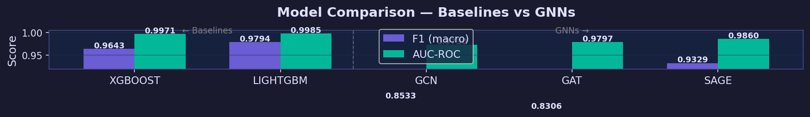
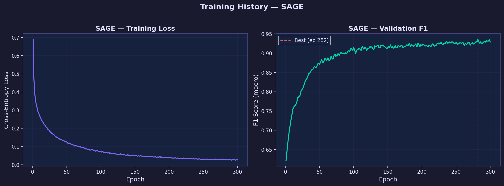
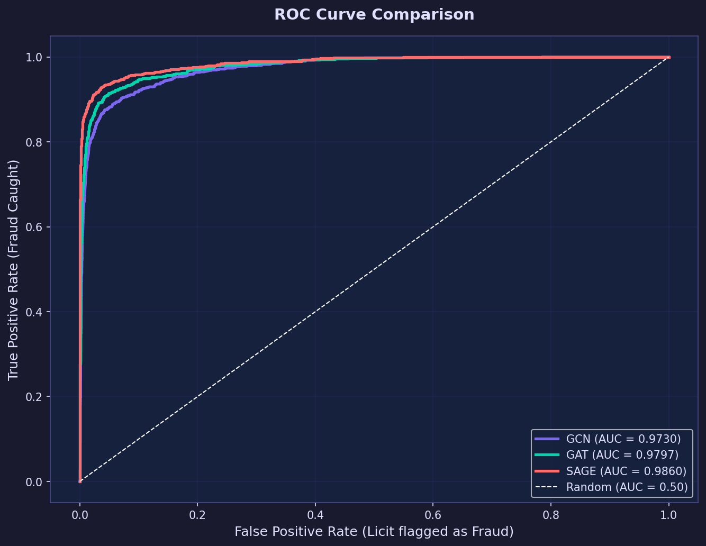

# GraphFraud — Bitcoin Transaction Fraud Detection with Graph Neural Networks

<p align="center">
  
</p>

<p align="center">
  <b>End-to-end fraud detection on the Bitcoin blockchain using GNNs (GCN, GAT, GraphSAGE) vs. tabular baselines (XGBoost, LightGBM).</b>
</p>

---

## Overview

GraphFraud is a complete machine learning pipeline that detects fraudulent Bitcoin transactions by modeling the blockchain as a **graph**. It compares three Graph Neural Network architectures—**GCN**, **GAT**, and **GraphSAGE**—against strong gradient-boosting baselines on the public [Elliptic Bitcoin Dataset](https://www.kaggle.com/datasets/ellipticco/elliptic-data-set).

**Key insight:** Bitcoin transactions form a natural graph (wallets → transactions → wallets). While traditional ML treats each transaction in isolation, GNNs exploit the **network topology** to detect fraud patterns hidden in the flow of funds.

|  |  |
|---|---|
| **Dataset** | Elliptic Bitcoin Dataset (203K nodes, 234K edges, 49 timesteps) |
| **Task** | Semi-supervised binary node classification (illicit vs. licit) |
| **Challenge** | Extreme class imbalance (~9.8% fraud), 77% unlabelled nodes |
| **Models** | GCN, GAT, GraphSAGE, XGBoost, LightGBM |
| **Framework** | PyTorch Geometric, scikit-learn, Streamlit |
| **Hardware** | Apple M4 (MPS), CUDA, or CPU |

---

## Results

### Final Model Comparison

| Model | Type | F1 (macro) ↑ | AUC-ROC ↑ | Fraud Recall |
|---|---|---|---|---|
| **LightGBM** | Baseline | **0.9794** | **0.9985** | — |
| XGBoost | Baseline | 0.9643 | 0.9971 | — |
| **GraphSAGE** | GNN | **0.9329** | **0.9860** | 89.1% |
| GCN | GNN | 0.8533 | 0.9730 | 88.3% |
| GAT | GNN | 0.8306 | 0.9797 | **92.9%** |

**Findings:**
- **GraphSAGE** is the strongest GNN, approaching tabular baseline performance (F1 0.9329 vs. 0.9794).
- **GAT** achieves the highest fraud recall (92.9%) — ideal as a first-pass screening model.
- Tabular models excel because 71/165 features are *pre-engineered neighbourhood aggregations*, partially baking graph signal into the feature set.
- A **hybrid pipeline** (LightGBM for speed + GNN for contextual analysis of flagged transactions) is the recommended production architecture.

### Training Curves

<p align="center">
  
</p>

---

## Quick Start

### Prerequisites

- Python 3.10+
- [Elliptic Bitcoin Dataset](https://www.kaggle.com/datasets/ellipticco/elliptic-data-set) placed in `data/raw/`

### Installation

```bash
git clone <repo-url>
cd GraphFraud
pip install -r requirements.txt
```

### Run the Pipeline

```bash
# 1. Verify data pipeline
python -m src.data.ingest         # Load CSVs, print label distribution
python -m src.data.preprocess     # Split data, print split sizes
python -m src.data.graph_builder  # Build graph, print node/edge counts

# 2. Train tabular baselines
python -m src.models.baseline     # XGBoost + LightGBM

# 3. Train all GNNs (~10-15 min on Apple M4)
python -m src.training.train      # GCN, GAT, GraphSAGE with early stopping

# 4. Run tests
pytest tests/ -v

# 5. Launch interactive dashboard
streamlit run app/streamlit_app.py
# → Open http://localhost:8501
```

---

## Project Structure

```
GraphFraud/
├── configs/
│   └── config.yaml              # Hyperparameters & paths
├── data/
│   └── raw/                     # Elliptic dataset CSVs
│       ├── elliptic_txs_features.csv
│       ├── elliptic_txs_classes.csv
│       └── elliptic_txs_edgelist.csv
├── src/
│   ├── data/
│   │   ├── ingest.py            # CSV loading & label mapping
│   │   ├── preprocess.py        # Feature engineering & splits
│   │   └── graph_builder.py     # NetworkX + PyG graph construction
│   ├── models/
│   │   ├── baseline.py          # XGBoost & LightGBM training
│   │   ├── gcn.py               # Graph Convolutional Network
│   │   ├── gat.py               # Graph Attention Network
│   │   └── sage.py              # GraphSAGE (inductive)
│   ├── training/
│   │   ├── train.py             # Full GNN training loop
│   │   └── evaluate.py          # Metrics, masks, class weights
│   └── visualization/
│       └── plots.py             # Matplotlib visualizations
├── app/
│   └── streamlit_app.py         # Interactive dashboard
├── tests/
│   ├── test_data.py             # 13 unit tests for data pipeline
│   └── test_models.py           # 18 unit tests for GNN models
├── outputs/
│   ├── models/                  # Saved GNN checkpoints (.pt)
│   ├── reports/                 # JSON results
│   └── figures/                 # Generated plots
└── notebooks/                   # Exploratory analysis
```

---

## Architecture

```
Raw CSVs → Data Pipeline → Graph Builder → Tabular Baselines
                                    ↓
                              GNN Training (GCN/GAT/SAGE)
                                    ↓
                            Evaluation (F1, AUC-ROC)
                                    ↓
                           Streamlit Dashboard
```

### GNN Architectures

| Model | Mechanism | Strength |
|---|---|---|
| **GCN** | Symmetric normalized adjacency aggregation | Simple, fast, strong baseline |
| **GAT** | Learnable attention coefficients per neighbour | Highest fraud recall (92.9%) |
| **GraphSAGE** | Sampled neighbour mean + inductive learning | Best GNN overall, generalises to new nodes |

All GNNs use:
- **2 layers** (tuned down from 3 to reduce over-smoothing with 77% unlabelled nodes)
- **128 hidden channels** (doubled from 64 for more capacity)
- **BatchNorm + ReLU/ELU + Dropout(0.3)** for stable training
- **Weighted CrossEntropyLoss** to handle 9:1 class imbalance
- **Early stopping** (patience=40) with best-checkpoint saving

---

## Dataset

The [Elliptic Bitcoin Dataset](https://www.kaggle.com/datasets/ellipticco/elliptic-data-set) is an industry-standard benchmark for blockchain fraud detection:

| Property | Value |
|---|---|
| Nodes (transactions) | 203,769 |
| Edges (fund flows) | 234,355 |
| Features per node | 165 (94 local + 71 neighbourhood aggregates) |
| Timesteps | 49 biweekly snapshots (~2011–2019) |
| Labelled nodes | 46,564 (22.8%) |
| Fraud rate | 9.8% |

**Citation:** M. Weber et al., "Anti-Money Laundering in Bitcoin: Experimenting with Graph Convolutional Networks for Financial Forensics," KDD 2019.

---

## Why GNNs vs. Tabular Models?

|  | Tabular (XGBoost/LightGBM) | GNNs (GCN/GAT/SAGE) |
|---|---|---|
| **Input** | Node features only | Features + graph structure |
| **Unlabelled nodes** | Discarded | Used for message passing |
| **Fraud signal** | Feature patterns | Feature + topological patterns |
| **New nodes** | Retrain required | GraphSAGE: generalises inductively |
| **Speed** | Fast | Slower (message passing overhead) |

On this dataset, tabular models win in absolute F1 because the 71 aggregated features already encode neighbourhood information. However, GNNs capture **topological fraud patterns** that feature engineering cannot—making them valuable in a hybrid production system.

---

## Dashboard Preview

The Streamlit app provides three interactive tabs:

1. **Dataset Overview** — Fraud rate over time, label distribution, feature stats
2. **Train GNN** — Select architecture, view hyperparameters, train with live progress
3. **Compare Models** — Side-by-side results table and visual comparison

<p align="center">
  
</p>

---

## Testing

```bash
pytest tests/ -v
```

- **13 tests** for data pipeline (ingest, preprocess, graph building)
- **18 tests** for GNN models (forward pass shapes, mask correctness, device handling)

---

## Hyperparameter Tuning

Key tuned parameters and their impact:

| Parameter | Original | Tuned | Impact |
|---|---|---|---|
| `num_layers` | 3 | **2** | Reduced over-smoothing (+29% F1 for GCN) |
| `hidden_channels` | 64 | **128** | More model capacity |
| `lr` | 0.001 | **0.01** | Faster convergence |
| `patience` | 20 | **40** | Models train longer before stopping |
| `epochs` | 200 | **300** | More training budget |

**Result:** GraphSAGE improved from F1 0.7367 → 0.9329 (+26.6%).

---

## Future Work

| Improvement | Expected Impact |
|---|---|
| Temporal GNN (T-GNN) | Model fraud evolution across 49 timesteps |
| Edge features | Incorporate transaction amounts, timing, fees |
| Larger datasets (e.g., DGraph-Fin) | More training data, richer graph structure |
| Label propagation | Leverage semi-supervised structure for unknown nodes |
| GraphTransformer / GIN | More expressive architectures |
| GNN + LightGBM ensemble | Best of both worlds |

---

## References

1. **Elliptic Dataset:** M. Weber et al., KDD 2019. [arXiv:1908.02591](https://arxiv.org/abs/1908.02591)
2. **GCN:** T.N. Kipf & M. Welling, ICLR 2017. [arXiv:1609.02907](https://arxiv.org/abs/1609.02907)
3. **GAT:** P. Veličković et al., ICLR 2018. [arXiv:1710.10903](https://arxiv.org/abs/1710.10903)
4. **GraphSAGE:** W.L. Hamilton et al., NeurIPS 2017. [arXiv:1706.02216](https://arxiv.org/abs/1706.02216)
5. **XGBoost:** T. Chen & C. Guestrin, KDD 2016. [arXiv:1603.02754](https://arxiv.org/abs/1603.02754)
6. **LightGBM:** G. Ke et al., NeurIPS 2017.
7. **PyTorch Geometric:** M. Fey & J.E. Lenssen, ICLR 2019. [arXiv:1903.02428](https://arxiv.org/abs/1903.02428)

---

Built with PyTorch, PyTorch Geometric, XGBoost, LightGBM, NetworkX, and Streamlit.
