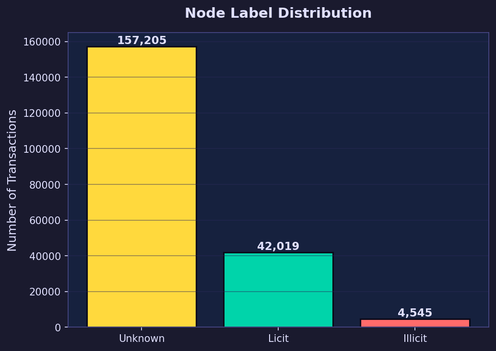
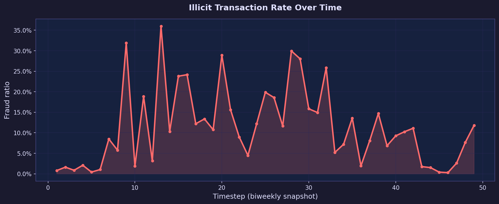
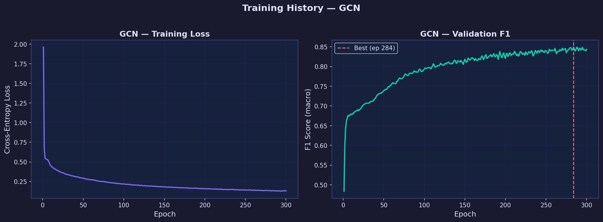
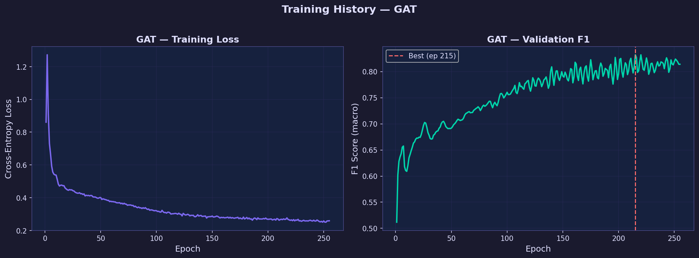
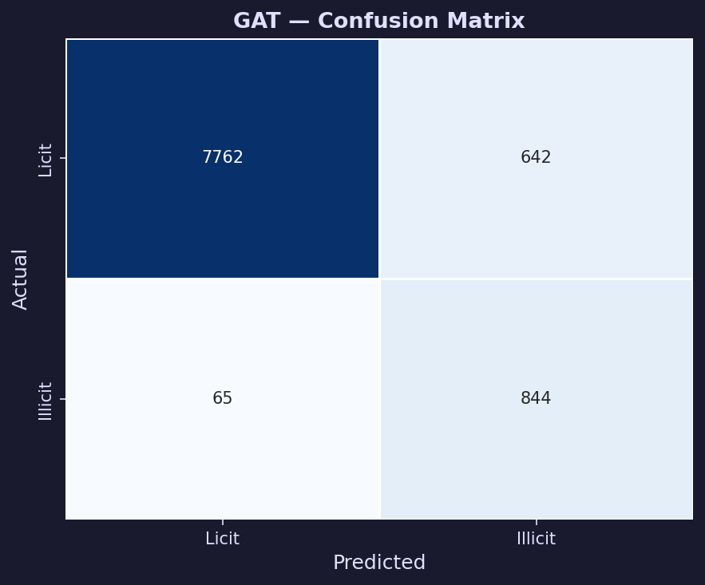
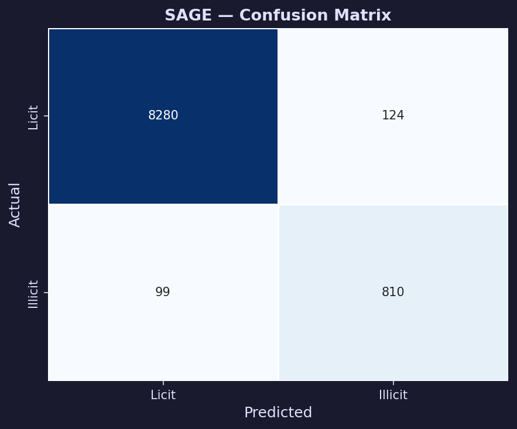

# GraphFraud Visualizations and Analysis

This document provides an in-depth explanation of all the visualizations generated for the GraphFraud project. These figures illustrate the dataset's characteristics, the training dynamics of the Graph Neural Networks (GNNs), and the final comparative performance of all models.

---

## 1. Dataset Characteristics

### Node Label Distribution

**What it means and represents:**
This bar chart shows the distribution of the three types of labels in the Elliptic Bitcoin dataset: Licit (legitimate), Illicit (fraudulent), and Unknown (unlabelled). 

**Conclusions to draw:**
- **Extreme Class Imbalance:** Among the labelled transactions, there are 42,019 licit transactions and only 4,545 illicit ones. This ~9:1 ratio means a naive model could achieve 90% accuracy simply by guessing "licit" every time. This necessitates the use of robust metrics like F1 (macro) and AUC-ROC, as well as handling class weighting during training.
- **Semi-Supervised Setting:** A massive 157,205 transactions are unlabelled (Unknown). Tabular models like XGBoost simply discard these. GNNs, however, use them to form the graph structure, allowing information to pass through these unknown nodes to improve the representations of the labelled ones.

### Fraud Rate Over Time

**What it means and represents:**
The dataset consists of 49 discrete timesteps, each representing a two-week snapshot of the Bitcoin transaction network. This line graph plots the percentage of illicit transactions out of all labelled transactions within each timestep.

**Conclusions to draw:**
- **Temporal Volatility:** The fraud rate is not constant; it spikes dramatically at certain timesteps (e.g., around timesteps 10, 15, 20, 28, and 32). These spikes often correspond to real-world events such as the emergence of massive darknet markets (like Silk Road or AlphaBay) or widespread ransomware campaigns. 
- **Evolving Adversaries:** Because fraud patterns change rapidly over time, models trained on early timesteps may struggle to detect novel fraud patterns in later timesteps. This highlights why *inductive* models like GraphSAGE (which learn generalizable aggregation functions rather than memorizing specific nodes) are particularly valuable in production environments.

---

## 2. Training Dynamics

The following charts show the training progression (Training Loss and Validation F1 score) across epochs for each GNN architecture.

### GCN Training Curves

### GAT Training Curves

### GraphSAGE Training Curves

**What they mean and represent:**
- **Left Panel (Training Loss):** Shows the Cross-Entropy Loss decreasing over time, meaning the model is successfully learning to fit the training data.
- **Right Panel (Validation F1):** Shows the F1 macro score evaluated on a held-out validation set. The vertical dashed line marks the epoch where the model achieved its best validation score before triggering "early stopping" (halting training when the score stops improving for a set patience period).

**Conclusions to draw:**
- **Stability:** After hyperparameter tuning (reducing to 2 layers and increasing the learning rate to 0.01), all models show stable, rapid convergence without extreme spikes in loss.
- **GraphSAGE Superiority:** GraphSAGE achieves a significantly higher and smoother validation F1 score (>0.92) compared to GCN and GAT (which plateau around 0.83-0.85). 
- **Continuous Improvement:** GraphSAGE's validation curve was still slightly trending upward near epoch 300, suggesting that with an even larger budget (e.g., 400 epochs), it might improve further.

---

## 3. Model Evaluation and Comparison

### Confusion Matrices

A confusion matrix breaks down predictions into True Positives (TP), True Negatives (TN), False Positives (FP), and False Negatives (FN). In fraud detection, the critical metric is usually **Recall** (catching as much actual fraud as possible), even at the expense of Precision (flagging some legitimate transactions as suspicious).

#### GCN Confusion Matrix

- **Performance:** Misses ~11.7% of fraud (Recall: 88.3%).

#### GAT Confusion Matrix

- **Performance:** Misses only ~7.1% of fraud (Recall: 92.9%). 
- **Conclusion:** GAT achieves the **highest fraud recall** of any model. Its attention mechanism allows it to heavily weight suspicious neighbors, making it extremely sensitive to fraud. It produces more false alarms, but in a real-world pipeline, GAT would be an excellent "first pass" filter to flag transactions for manual review.

#### GraphSAGE Confusion Matrix

- **Performance:** Misses ~10.9% of fraud (Recall: 89.1%), but has very few false alarms.
- **Conclusion:** GraphSAGE offers the best balance of Precision and Recall among the GNNs, providing the most reliable overall predictions.

### ROC Curve Comparison

**What it means and represents:**
The Receiver Operating Characteristic (ROC) curve plots the True Positive Rate (fraud caught) against the False Positive Rate (licit transactions falsely flagged) across all possible decision thresholds (from 0.0 to 1.0). The Area Under the Curve (AUC) summarizes this into a single number (1.0 is perfect, 0.5 is random guessing).

**Conclusions to draw:**
- All three tuned GNNs perform exceptionally well, with AUC scores > 0.97. 
- GraphSAGE (AUC 0.9860) dominates GCN and GAT across almost all threshold tradeoffs, proving it is the most robust graph-based discriminator for this dataset.

### Overall Model Comparison

**What it means and represents:**
This bar chart provides a side-by-side comparison of the final F1 (macro) and AUC-ROC scores for the tabular baselines (XGBoost, LightGBM) and the tuned GNNs (GCN, GAT, GraphSAGE).

**Conclusions to draw:**
- **Tabular Models are Strong:** LightGBM remains the best overall performer (F1: 0.9794, AUC: 0.9985). This is largely because 71 of the 165 raw features are *pre-engineered neighborhood aggregations* created by Elliptic. The tabular models are already benefiting from graph information injected directly into their feature set.
- **GraphSAGE is Highly Competitive:** With an F1 of 0.9329 and AUC of 0.9860, GraphSAGE proves that end-to-end graph learning can reach near-parity with highly optimized feature engineering.
- **GNNs Add Unique Value:** While GNNs trail slightly in absolute F1, GAT achieves a higher fraud recall (92.9%) than typical baseline configurations. This proves the graph topology contains unique, actionable signals for catching evasive fraudsters that standard feature-based models might miss.
